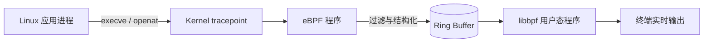

# procwatch


基于 eBPF、libbpf 与 CO-RE 的轻量级 Linux 进程行为监控工具。项目从内核 tracepoint 采集进程创建与敏感文件访问事件，通过 Ring Buffer 实时传递给用户态程序，适合用于主机安全审计学习和异常行为排查。

## 架构



## 功能

| 模块 | 监控点 | 输出字段 | 用途 |
| --- | --- | --- | --- |
| `procwatch_execve` | `sys_enter_execve` | 时间、PID、PPID、UID、进程名、执行路径 | 追踪进程创建与脚本执行链路 |
| `procwatch_openat` | `sys_enter_openat` | 告警类型、时间、PID、UID、进程名、访问路径 | 审计 `/etc/passwd`、`/etc/shadow`、`/etc/sudoers` 与 `.ssh/` 路径访问 |

## 技术实现

- 使用 tracepoint 挂载 eBPF 程序，避免修改业务进程。
- 使用 BTF 与 CO-RE 读取内核结构，降低对目标主机内核头文件的依赖。
- 使用 256 KiB Ring Buffer 在内核态与用户态之间异步传递事件。
- 使用 bpftool 自动生成 BPF Skeleton，由 libbpf 完成程序加载、挂载和资源释放。

## 环境要求

- Linux 内核 5.8 或更高版本，并提供 `/sys/kernel/btf/vmlinux`
- x86_64（默认）或 arm64；其他架构可通过 `BPF_ARCH` 指定
- clang/LLVM、bpftool、gcc、make
- libbpf、libelf、zlib 开发包
- root 权限或等价的 BPF 能力集

以 Ubuntu/Debian 为例：

```bash
sudo apt update
sudo apt install -y clang llvm bpftool gcc make libbpf-dev libelf-dev zlib1g-dev
```

以 Rocky Linux/Fedora 为例：

```bash
sudo dnf install -y clang llvm bpftool gcc make libbpf-devel elfutils-libelf-devel zlib-devel
```

## 编译与运行

```bash
git clone https://github.com/britta1219x/procwatch.git
cd procwatch

# 检查编译工具与内核 BTF，随后生成 vmlinux.h、BPF Skeleton 和可执行文件
make

# 进程创建监控
sudo ./procwatch_execve

# 敏感文件访问监控
sudo ./procwatch_openat
```

arm64 主机可使用：

```bash
make BPF_ARCH=arm64
```

## 示例输出

`procwatch_execve`：

```text
TIME     PID     PPID    UID   COMM             FILENAME
16:58:43 35468   35445   1000  bash             /usr/bin/su
16:58:44 35481   35468   0     su               /bin/bash
16:58:47 35514   35481   0     bash             /usr/bin/ls
```

`procwatch_openat`：

```text
ALERT     TIME     PID     UID   COMM             PATH
[PASSWD ] 17:02:01 35578   0     cat              /etc/passwd
[SHADOW ] 17:02:12 35579   0     cat              /etc/shadow
```

## 项目结构

```text
procwatch/
├── src/
│   ├── execve_monitor.bpf.c    # 进程创建事件采集
│   ├── execve_monitor.c        # execve 用户态读取程序
│   ├── openat_monitor.bpf.c    # 敏感路径过滤与事件采集
│   └── openat_monitor.c        # openat 用户态读取程序
├── include/                    # libbpf 相关头文件；构建时生成 vmlinux.h 与 Skeleton
├── Makefile
└── README.md
```

## 如何验证

在一个终端启动监控，在另一个终端执行测试命令：

```bash
# 触发 execve 事件
/usr/bin/id

# 触发敏感文件访问事件
head -n 1 /etc/passwd
sudo head -n 1 /etc/shadow
```

按 `Ctrl+C` 可安全退出监控程序。

## 支持范围与已知限制

- 当前监控 `execve` 与 `openat` tracepoint，不覆盖 `execveat`、`openat2` 等其他入口。
- 敏感路径规则在 eBPF 程序中静态定义，暂不支持运行时配置与白名单。
- 事件仅输出到终端，暂不支持 JSON、文件持久化或远程告警。
- 路径长度上限为 256 字节；超长路径可能被截断。
- CO-RE 依赖目标内核 BTF；不提供 BTF 的旧内核需要额外适配。
- 当前项目用于学习与审计辅助，不替代完整的 EDR、审计或入侵检测系统。

## 后续计划

- [ ] 增加白名单和可配置路径规则
- [ ] 支持 JSON Lines 与文件持久化
- [ ] 增加事件统计和丢包指标
- [ ] 补充自动化构建与多内核兼容性测试
